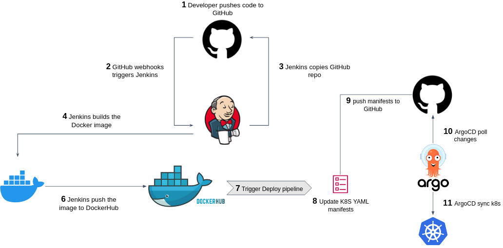

# Netflix Service Deployment Project

## Table of contents
  1. [About the project](#About-the-project)
  2. [Skills demonstrated](#Skills-demonstrated)
  3. [Technologies used](#Technologies-used)
  4. [Getting started](#Getting-started)
  5. [Usage](#Usage)
  6. [Architecture](#Architecture)

## About the project
This project focuses on the complete deployment and management of a Netflix-style service in a Kubernetes environment. It includes building Docker images, deploying microservices, establishing CI/CD pipelines using Jenkins and ArgoCD, and automating the entire process for seamless development and deployment.
**The project includes the following microservices:**
[NetflixFrontend](https://github.com/YgalIdan/NetflixFrontend): Handles the user interface.
[NetflixBackend](https://github.com/YgalIdan/NetflixMovieCatalog): Manages movie data and catalog information.

## Skills demonstrated
- **Containerization and Docker Image Management:**  
I built Docker images for microservices, conducted local testing to ensure functionality, and managed images in DockerHub repositories, implementing automated processes for building, pushing, and updating images.
- **Kubernetes Orchestration and Deployment:** 
I created Kubernetes manifest files for deploying microservices, managed deployments in a Kubernetes cluster, and performed validation using port-forwarding to ensure proper functioning of the microservices.
- **GitOps and Continuous Deployment with ArgoCD:**  
I used ArgoCD to manage automatic deployments of microservices, integrating GitOps-based processes that automatically update deployments based on changes in GitHub, ensuring continuous and efficient updates.
- **CI/CD with Jenkins:**  
I developed Jenkins pipelines to automate Continuous Integration and Continuous Deployment (CI/CD) processes, including building Docker images, pushing them to repositories, and deploying them automatically in the Kubernetes cluster. This was integrated with ArgoCD to ensure complete automation.
- **Version Control and Collaboration with GitHub:**  
I managed code using GitHub, ensuring a smooth and transparent collaboration process. I utilized GitHub for tracking changes and versions, integrating Jenkins and ArgoCD for seamless and secure deployment updates.
- **DevOps Tools Proficiency:**  
I demonstrated full proficiency in key DevOps tools such as Docker, Kubernetes, Jenkins, and ArgoCD, designing and managing secure and efficient workflows. I maintained a systematic approach to automation and process improvement.
- **End-to-End Deployment Process:**  
I designed and implemented a complete development, testing, and deployment process that allows continuous automation of microservices, minimizing manual errors and enhancing overall efficiency.
- **Troubleshooting and Process Improvement:**  
I resolved technical issues that arose during development and deployment, automating processes that required quick and focused solutions, and improving the overall performance of the system.

## Technologies used

  &nbsp;&nbsp;
  &nbsp;&nbsp;
  &nbsp;&nbsp;
  &nbsp;&nbsp;
  &nbsp;&nbsp;
  

- GitHub
- Jenkins
- Docker
- YAML
- ArgoCD
- Kubernetes

## Getting started
### Prerequisites
1. Docker installed locally.
2. A configured Kubernetes cluster.
3. ArgoCD installed in the cluster.
4. A Jenkins server with an agent configured.

### Deployment Steps
1. Clone the code repositories:
    - [NetflixFrontend](https://github.com/YgalIdan/NetflixFrontend)
    - [NetflixBackend](https://github.com/YgalIdan/NetflixMovieCatalog)
2. Build Docker images locally and push them to DockerHub.
3. Apply Kubernetes configuration files from the NetflixInfra repository to deploy the microservices.
4. Configure ArgoCD applications to manage deployments.
5. Use the Jenkins pipeline to automate builds and deployments.

## Usage

## Architecture
